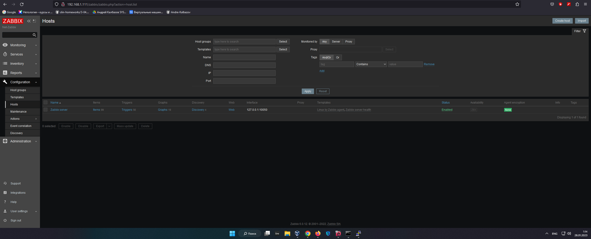
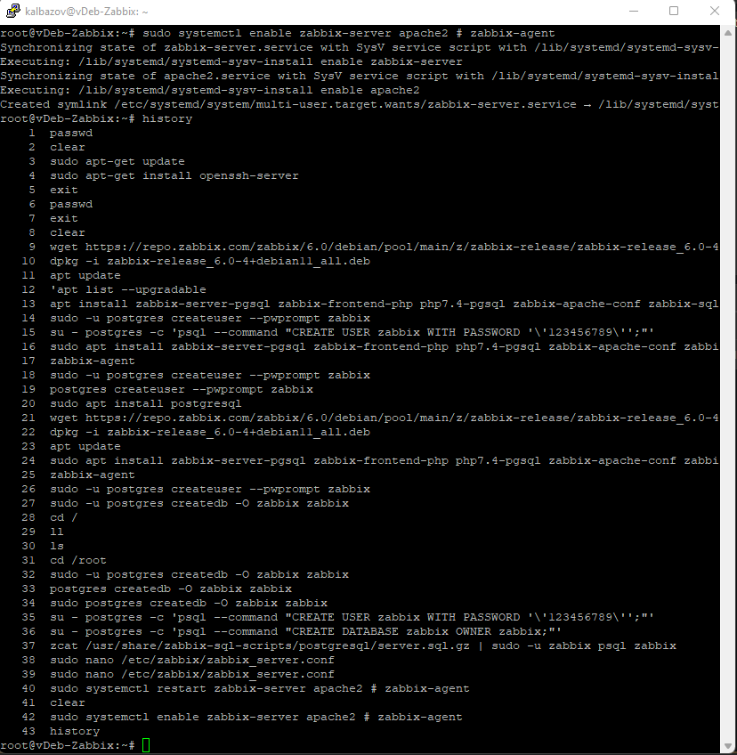
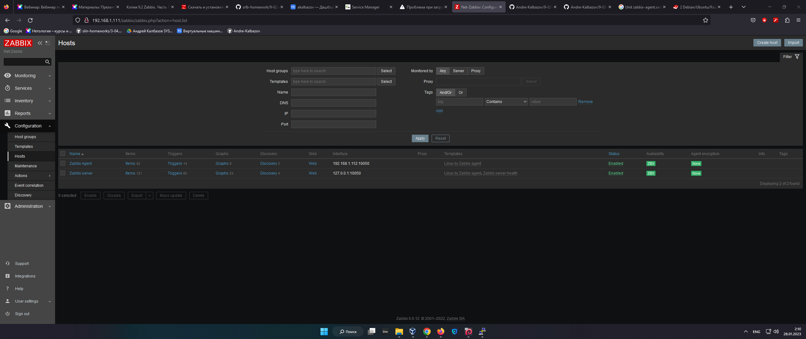
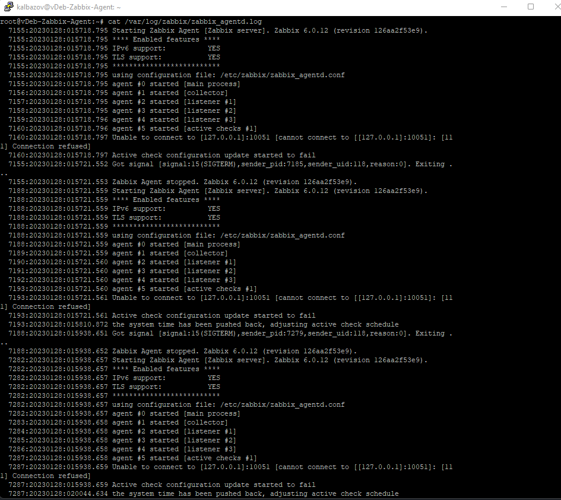

### Домашнее задание к занятию 9.2 «Zabbix. Часть 1»

## Задание 1

 - Установите Zabbix Server с веб-интерфейсом.

1. Приложите скриншот авторизации в админке. Приложите текст использованных команд в GitHub.

## Задание 2

 - Установите Zabbix Agent на два хоста.

1. Приложите скриншот раздела Configuration > Hosts, где видно, что агенты подключены к серверу. 
2. Приложите скриншот лога zabbix agent, где видно, что он работает с сервером. 
3. Приложите скриншот раздела Monitoring > Latest data для обоих хостов, где видны поступающие от агентов данные. 
4. Приложите текст использованных команд в GitHub.

